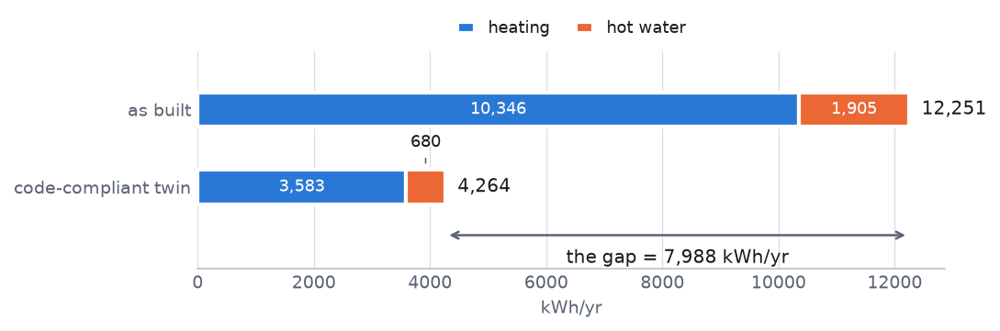
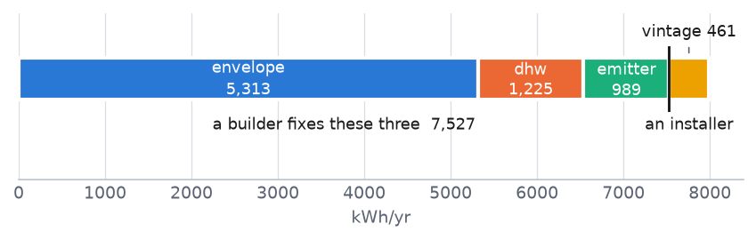

# How the physical baseline works - one house, traced end to end

> ## 7,142 kWh/yr
>
> **at least this much more electricity than a code-compliant version of the same house**
>
> point estimate 7,988  ·  band 7,142 to 9,935 kWh/yr  ·  at least +168% over code  ·  household 116121, ranked 1 of the fleet  ·  completeness T1

Household **116121** of the HEAPO audit set, followed from the floor area an auditor wrote down to its position at the top of the visit list. Then three short cases where a different rule takes over.

**Read it either way.** The plain text carries the argument and needs no background. The grey technical lines under each step give the formula and the exact quantity, and can be skipped or checked.

> This document says **how the model works**, not whether it works. It makes no performance claim; that belongs in the results section of the report. Every number here is generated by `p27_walkthrough.py` - none is typed by hand, so it cannot quietly go stale when a constant changes.


## Where every number comes from - four tags

The question this document exists to answer is *which numbers are ours*. "From a reference" is really two different things, so there are four tags:

| tag | family | meaning | count |
|---|---|---|---|
| `DATABASE` | from the database | HEAPO measured it, or an auditor recorded it - named to its column | 13 |
| `VERIFIED` | from a reference | a constant read in the cited primary document | 7 |
| `SECOND_HAND` | from a reference | source named but the document was not read here | 1 |
| `PHYSICAL` | from a reference | a physical property of air, not a modelling choice | 1 |
| `DERIVED` | **ours** | a constant **we** computed from published inputs; the test re-derives it | 4 |
| `GENERATED` | **ours** | computed by the model for this household | 17 |

The three families are colour-coded throughout, and the exact tag is always spelled out - so nothing is carried by colour alone and the whole document still reads in greyscale print. Six separate tag colours were tested and rejected: the worst pair is hard to tell apart even with full colour vision.

> **Nothing is fitted to consumption.** No constant was chosen, tuned or selected by looking at how much electricity these houses actually used. That is the calibration rule, and it is why a constant that happens to reproduce the data would be treated as a warning sign rather than a success.


## The question the model asks

Not *"is this house using a lot?"* - a big house uses a lot and that says nothing. The question is: **how much more electricity does this house use than a code-compliant version of the same house, on the same plot, in the same weather, with the same number of people?**

So the model builds the house **twice**. Once as it is (`E_as_built`) and once as the building code would have it (`E_reference`). The answer is the gap. Both levels exclude appliances, which is why **neither is a predicted bill** and only the difference means anything.


## Step 1 - the house, as recorded

Twelve inputs. All of them come from the audit or the weather archive; not one is guessed.

| input | value | HEAPO column |
|---|---|---|
| area_m2 | 395 | `Building_FloorAreaHeated_Total` |
| footprint_m2 | 235 | `max(Building_FloorAreaHeated_<storey>)` |
| n_storeys_above | 1 | `count(Building_FloorAreaHeated_<storey> > 0)` |
| heated_basement | True | `Building_FloorAreaHeated_Basement > 0` |
| era | pre1975 | `Building_ConstructionYear_Interval` |
| renovation_count | 0 | `Building_Renovated_Windows + _Walls + _Roof` |
| residents | 2 | `Building_Residents` |
| hp_type | air-source | `HeatPump_Installation_Type` |
| emitter | radiator_only | `HeatPump heat-distribution flags (floor / radiator)` |
| dhw_electric | True | `DHW_Production_ByElectricWaterHeater` |
| hp_install_year | 2009 | `HeatPump_Installation_Year` |
| hdd_normal_per_day | 4.05 | `weather_daily.parquet, station NORMAL year` |


## Step 2 - the envelope: how much surface loses heat

Heat escapes through the outside surface, so the model needs that area. It is not recorded, so it is built from the footprint: a square plan is the smallest possible perimeter for a given floor area, which keeps the estimate conservative.

```
perimeter = 4*sqrt(235 m2) * 1.00 = 61.32 m    |    thermal envelope = 600.84 m2 = 1.52 x heated floor area
```

A heated basement adds a storey of wall against earth and moves the lowest floor down. Earth is a milder neighbour than air, so both are charged at a reduced weight (**b_ground = 0.50**) rather than counted in full.


## Step 3 - ventilation, and the first thing that cancels

Air changes lose heat too. This term is **identical in both baselines** - the code-compliant twin breathes the same - so it contributes exactly zero to the answer. It is computed anyway, because it belongs in each level.

```
H_ventilation = rho_c * n_air * v_net_per_m2 * area = 165.19 W/K  ->  cancels in the difference
```


## Step 4 - the two U-values: where the baselines split

A U-value is how fast heat crosses a square metre of wall. This is the heart of the model: the house keeps **its own era's** U-value, the reference twin gets the **code** U-value, and everything else about the two houses is identical.

| quantity | value | unit | provenance |
|---|---|---|---|
| u_as_built (pre1975) | 0.9028 | W/m2K | `DERIVED` |
| u_reference (code) | 0.2466 | W/m2K | `DERIVED` |
| thermal bridge | +0.1000 | W/m2K | `VERIFIED` |

The thermal-bridge allowance is added to **both** houses, so like ventilation it cancels. Corners and balconies leak in a code house too.

```
H = U * A_envelope + H_ventilation    ->    H_as_built 767.71 W/K, H_reference 373.44 W/K, difference 394.27 W/K
```

> This house is **unrenovated**, so it takes its era value directly. Had it been renovated, no source gives the U-value of a half-renovated wall - so renovation **widens the band** toward the next-newer era instead of applying an invented correction. Widening an uncertainty is honest; inventing a number is not.


## Step 5 - efficiency, and the age of the unit

A heat pump multiplies electricity into heat. The multiplier (**JAZ**, the seasonal field average) depends on the unit type and on how hot the water has to be: floor heating runs cool and efficient, radiators run hot and lose ground.

| quantity | value | what it represents |
|---|---|---|
| jaz, current unit | 2.900 | an air-source unit with radiator_only, from the published field tables |
| vintage factor | 0.908 | this unit is from 2009, so it is an older generation |
| jaz, as built | 2.634 | current-unit value x vintage |
| jaz, reference | 3.700 | the twin gets floor heating **and** a current unit |
| jaz, hot water | 2.800 | separate figure for the cylinder |

> **Vintage is technology generation, not wear.** The field study behind it saw no efficiency loss over nine years of operation, so an older unit here is an older *design*, not a tired one. This is why the model never says "it is old" as if that were a fault.

This house heats its water with an **electric cylinder**, which has no multiplier at all - one kilowatt-hour in, one out. The reference twin uses the heat pump. That single difference is the whole hot-water term.


## Step 6 - the two totals, and the gap

Weather enters once, as degree-days from the station's **normal year** rather than from this household's own record. That deliberately keeps the length of a meter record out of the building score: a house with 18 months of data must not look worse than a house with five years.

|  | heating | hot water | total |
|---|---|---|---|
| as built | 10,346 | 1,905 | **12,251** |
| code-compliant twin | 3,583 | 680 | **4,264** |
| gap | 6,763 | 1,225 | **7,988** |

All figures kWh/yr. **7,988 kWh/yr** is the answer: what this house spends because it is not built to code.



*The same house, built twice. Everything is identical except the U-value and the hot-water source, so the gap is the answer. Appliances are in neither bar.*


## Step 7 - what the gap is made of, and who fixes it

A single number tells nobody what to do. The gap splits into four terms, and the split matters because **different people fix different terms**.

| term | kWh/yr | share | who fixes it |
|---|---|---|---|
| envelope | 5,313 | 67% | builder |
| dhw | 1,225 | 15% | builder |
| emitter | 989 | 12% | builder |
| vintage | 461 | 6% | installer |

Three of the four are the **fabric** - a builder's work. Only vintage belongs to an **installer**. For this house the envelope alone is 67% of the problem, so replacing the heat pump would leave most of the gap untouched.



*The gap split by who fixes it. Envelope alone is 67% of it, so replacing the heat pump would leave most of the gap standing.*

```
four terms sum to 7987.506579 kWh/yr == evaluate() deficiency == the shipped export value 7,988 (asserted at run time)
```


## Step 8 - the band, and why the lowest number is the one we use

Every constant above is published with a spread, not as a single truth. The model re-runs the whole calculation many times, drawing each constant from its own published range, which gives a range for the answer.

|  | kWh/yr | meaning |
|---|---|---|
| point | 7,988 | the middle estimate |
| **lower bound** | **7,142** | **what gets ranked and displayed - "at least this much"** |
| upper | 9,935 | the optimistic end |

The list is ordered on the **lower** bound, so a household's position is defensible: it claims only what survives the least favourable reading of the sources. Data completeness is reported beside it as a tier - this house is **T1**, the tightest.

> The band is the **published spread of the constants**, sampled. It is not an invented error bar and not a confidence interval from a fit, because there is no fit anywhere in this model.


## Step 9 - the decisions this produces

| decision | value | rule that fired |
|---|---|---|
| status | `HIGH_EXCESS` | confirmed excess over code, in the worst 25% of the fleet by lower bound |
| rank, fleet-wide | 1 | ordered on `phys_rank_value_lo_kwh_yr` |
| the unit | `PLAN_REPLACEMENT` | 15 years old as of 2024, against its measured expected service life |

**"Old" is never an action.** A replacement is recommended only at or past the expected service life, taken from measured failure data. A mid-life unit reads `KEEP_IN_LIFE` and its vintage kWh stay information rather than instruction.


## Three contrast cases - where a different rule takes over

One household can only ever show one path. These three show the model declining to answer, in three different ways.

| household | status | point | lower | what it demonstrates |
|---|---|---|---|---|
| 876511 | `HIGH_EXCESS` | 5,961 | 5,610 | **no claim on the unit.** Install year unrecorded, so the heat-pump point is **0** while its band opens at **13** - every draw samples an older unit. Show the band, never the zero |
| 121728 | `INCONCLUSIVE` | 176 | -133 | **the model refuses to claim.** A post-2010 house: the band crosses zero, so despite a positive point estimate there is no finding and no rank |
| 100120 | `INCOMPLETE_AUDIT` | - | - | **never computed.** building data missing: no_footprint;no_storeys |


*Why one of these is not ranked. The dot is the point estimate, the bar the published-spread band, and the number at the left end is the **lower bound** - the figure the ranking uses. 121728's band crosses the code line, so no excess is claimed and it gets no rank; the fourth case has no bar at all, never having been computed. Shown as percent over code, not kWh, because the question here is the sign, and 8,000 against 176 kWh on one axis would hide the small one.*

> **There is no "normal" status.** Confirming a house is fine would need its whole band at or below code, and not one household in the set achieves that. The model confirms an excess or says nothing - it never issues a clean bill of health, and nothing on the page may render green.


## Why the never-computed 42 are not one thing

A household can miss out for two unrelated reasons, and they need opposite responses. Measured here rather than taken from the export's summary string:

| cause | n | what actually fixes it |
|---|---|---|
| building data missing only | 21 | **an auditor can fix this** - go and record it |
| meter record too short only | 18 | only a longer record; no visit helps |
| both | 3 | both |

> **This split used to be invisible, and writing this document is what exposed it.** The export labelled all 42 with one blanket string: the cause was read from a frame joined to the *scored* households, so it was empty for exactly the unscored ones and every one fell through to a single default. **Fixed 2026-09-17** - `phys_no_result_reason` now carries **8 distinct per-household causes** and `phys_no_result_fix` names who acts (**24** record the missing building data - an auditor can do this / **18** none - needs a longer meter record). Read that column, not `phys_no_result_is_fixable`, which says only whether a household can ever become answerable - not whether to send anyone.


## How to read these numbers

Four scope limits that change how a figure should be read. None is a verdict on the model; each is a boundary on what a number means.

| limit | what it does to a number |
|---|---|
| The order leans old | per square metre the physics under-predicts newer buildings, so a fleet-wide list tilts toward older houses. Era is therefore a **filter** on the page, and the in-era rank is kept as a column |
| Bands are wide, on purpose | they carry the published disagreement between sources. A wide band is information, not a failure |
| Levels are not bills | appliances are excluded from both baselines. Only the **difference** is meaningful; neither level is what a household pays |
| Nothing is calibrated | where the physics and the meter disagree, the disagreement is **reported**, never tuned away |

The constants are Swiss. The **method** ports to another country; the **numbers** do not, and a new region means a new registry file rather than new code.

| artefact | path |
|---|---|
| this document | `outputs/p27/reports/p27_walkthrough.md` / `.html` |
| every traced number | `outputs/p27/data/p27_trace.csv` (43 rows) |
| the contrast cases | `outputs/p27/data/p27_contrast.csv` |
| the constants registry | `constants_ch.json` |
| the shipped export | `outputs/export/physical_baseline_v2.parquet` |
